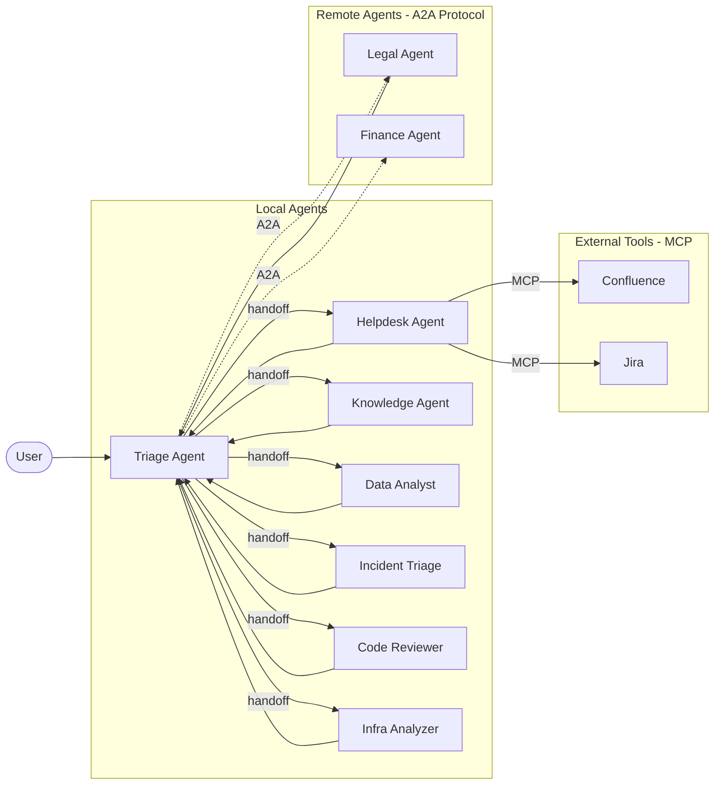

<!-- GitHub Topics: multi-agent, ai-agents, azure-ai-foundry, agent-framework,
     a2a-protocol, mcp, python, handoff-orchestration, ai-accelerator,
     microsoft-agent-framework — set these in repo Settings > Topics -->

# Agent Platform — Multi-Agent Accelerator for Azure AI Foundry

[](https://github.com/b-franken/agent-platform/actions/workflows/ci.yml)
[](LICENSE)
[](https://www.python.org/downloads/)
[](https://github.com/microsoft/agent-framework)

A plug-and-play multi-agent platform on [Azure AI Foundry](https://learn.microsoft.com/en-us/azure/ai-foundry/). Build, connect, and deploy AI agents that work together using open standards.

[](https://codespaces.new/b-franken/agent-platform)

## What makes this different

- **[A2A](https://a2a-protocol.org/) + [MCP](https://modelcontextprotocol.io/) combined** — connect agents across frameworks (A2A) and external tools (MCP) in one platform
- **Drop-in agents** — add a package to `agents/`, run `uv sync`, the router auto-discovers it
- **Declarative HITL** — `@tool(approval_mode="always_require")` — one decorator, no custom approval code
- **3-layer middleware** — InputGuard, logging, and sensitive data masking with [early termination](https://learn.microsoft.com/en-us/agent-framework/agents/middleware/)
- **Checkpoint + resume** — pause and resume conversations across process restarts
- **Azure-native** — Managed Identity, VNet isolation, Azure AI Foundry integration

Built on [Microsoft Agent Framework](https://github.com/microsoft/agent-framework) with [HandoffBuilder](https://learn.microsoft.com/en-us/agent-framework/workflows/orchestrations/handoff) orchestration.

> **Note:** Microsoft Agent Framework is currently in Release Candidate (RC5) and A2A support is in beta. This platform tracks the latest pre-release versions. Pin your dependencies in production.

## How it works



1. **User sends a question** — via CLI, DevUI, or API
2. **Triage agent analyzes and routes** — reads each agent's description to pick the right specialist
3. **Specialist uses its tools** — KB search, SQL queries, file search, MCP tools, or A2A calls
4. **Response flows back** — through the triage agent to the user

New agents are auto-discovered. Drop a package in `agents/`, run `uv sync`, and the router picks it up.

## Features

- **A2A protocol** — connect agents across frameworks and services ([demo](examples/a2a-demo/))
- **MCP integration** — connect Confluence, Jira, SharePoint without code
- **Plugin architecture** — `scaffold` → `configure` → `deploy`
- **Auto-discovery** — no manifest or registry needed
- **Human-in-the-loop** — one decorator: `@tool(approval_mode="always_require")`
- **RAG built-in** — drop documents in `knowledge/`, upload to vector store
- **Checkpointing** — resume conversations after interruptions
- **Middleware stack** — InputGuard, logging, sensitive data masking
- **Terraform IaC** — POC (~$10/mo) and enterprise environments
- **Observability** — OpenTelemetry + Aspire Dashboard

<details>
<summary><strong>Prerequisites</strong></summary>

- **Azure subscription** — [free trial](https://azure.microsoft.com/free/)
- **Azure AI Foundry** resource with a model deployment (e.g., `gpt-4.1`)
- **Python 3.13+** — [download](https://www.python.org/downloads/)
- **uv** package manager — `pip install uv`
- **Azure CLI** — [install](https://learn.microsoft.com/cli/azure/install-azure-cli), then `az login`

</details>

## Quick start

### Option 1: GitHub Codespaces (fastest)

Click **Open in GitHub Codespaces** above. Everything is pre-configured.

### Option 2: Local

```bash
pip install uv
git clone https://github.com/b-franken/agent-platform.git
cd agent-platform
uv sync

cp .env.example .env
# Edit .env — set AZURE_AI_PROJECT_ENDPOINT and AZURE_OPENAI_RESPONSES_DEPLOYMENT_NAME

az login
uv run python -m agent_core.validate
uv run --package router-agent python -m router.main
```

You should see:

```
Agent Platform — Interactive Mode
Discovered agents: helpdesk, knowledge-agent, data-analyst
Type your question (or 'quit' to exit):
You >
```

### Option 3: Azure Developer CLI

```bash
azd up    # Deploys infrastructure + application in one command
```

## Add your own agent

```bash
uv run python -m agent_core.scaffold my-agent --description "What it does"
# Edit agents/my-agent/src/my_agent/tools.py and config.py
uv sync
uv run python -m agent_core.validate
# Restart — the router auto-discovers your new agent
```

See [docs/adding-agents.md](docs/adding-agents.md) for the full guide with examples.

## Agent catalog

| Agent | What it demonstrates | Data source | Framework Features |
|-------|---------------------|-------------|-------------------|
| **helpdesk** | IT troubleshooting + ticket management | YAML KB, SQLite | `@tool`, `approval_mode` HITL |
| **knowledge-agent** | Company docs search with citations | Markdown files | RAG, `file_search`, vector store |
| **data-analyst** | Natural language SQL queries | SQLite sample DB | Schema discovery, input validation |
| **expense-approver** | Budget checks + expense submission | SQLite | `approval_mode`, HITL |
| **incident-triage** | Severity classification + runbook lookup | Keyword matching | **Structured Output** (`response_format`) |
| **code-reviewer** | Code quality + security scanning | Regex patterns | Deterministic analysis, streaming |
| **infra-analyzer** | Terraform scanning + remediation | Regex HCL matching | **Tool Approval** HITL |
| **router** | Triage routing to specialists | — | HandoffBuilder, auto-discovery |

> **Note:** All agents use local demo data (YAML, SQLite, regex) — no external API keys needed. This is intentional: the platform works out of the box. See [docs/production.md](docs/production.md) for connecting real data sources.

### Examples

- [A2A demo](examples/a2a-demo/) — cross-framework agents communicating via the A2A protocol
- [MCP server](examples/mcp-server/) — expose tools via Model Context Protocol

## Learning path

1. **Start here** — study `helpdesk` (YAML KB, SQLite tickets, HITL)
2. **Build your first agent** — [Tutorial](docs/tutorial.md) (~15 min)
3. **Structured output** — study `incident-triage` (Pydantic models as `response_format`)
4. **Security scanning** — study `code-reviewer` and `infra-analyzer`
5. **Multi-agent orchestration** — study `router` (HandoffBuilder, auto-discovery)
6. **Cross-service agents** — run the [A2A demo](examples/a2a-demo/) and [MCP server](examples/mcp-server/)
7. **Deploy** — [Deployment guide](docs/deployment.md)

## Project structure

```
agents-platform/
├── packages/agent-core/        # Shared library (config, factory, middleware, registry)
├── agents/
│   ├── router/                 # Triage + HandoffBuilder orchestration
│   ├── helpdesk/               # IT troubleshooting, KB search, ticket creation
│   ├── knowledge-agent/        # Company docs search with RAG citations
│   ├── data-analyst/           # Natural language SQL queries
│   ├── expense-approver/       # Human-in-the-loop demo
│   ├── incident-triage/        # Structured output + context providers
│   ├── code-reviewer/          # Code quality + security analysis
│   └── infra-analyzer/         # Terraform scanning + tool approval HITL
├── examples/
│   ├── a2a-demo/               # A2A cross-framework demo
│   └── mcp-server/             # MCP server example
├── infra/                      # Terraform with Azure Verified Modules
├── deployment/azurefunctions/  # Azure Functions deployment
├── scripts/                    # Setup and pre-flight checks
├── tests/                      # Unit tests
├── evals/                      # Agent quality evaluations
└── docs/                       # Documentation
```

## Documentation

| Guide | Description |
|-------|-------------|
| [Getting Started](docs/getting-started.md) | Setup and first run |
| [Tutorial: Build Your First Agent](docs/tutorial.md) | Step-by-step from zero |
| [Key Concepts](docs/concepts.md) | Multi-agent systems, A2A, MCP, RAG explained |
| [Adding Agents](docs/adding-agents.md) | The plugin contract and patterns |
| [Architecture](docs/architecture.md) | How the platform works under the hood |
| [Deployment](docs/deployment.md) | Local, Docker, Azure deployment options |
| [From Demo to Production](docs/production.md) | Connect real data sources |
| [Cost Optimization](docs/cost-optimization.md) | Model selection and cost tips |
| [Evaluations](docs/evals.md) | Agent quality testing framework |
| [Troubleshooting](docs/troubleshooting.md) | Common issues and fixes |
| [FAQ](docs/faq.md) | Frequently asked questions |

## Deployment options

| Method | Use case | Command |
|--------|----------|---------|
| CLI | Local development | `uv run --package router-agent python -m router.main` |
| DevUI | Browser-based testing | `uv run devui --port 8080` |
| Docker | Containerized dev | `docker compose up` |
| azd | One-command Azure deploy | `azd up` |
| Terraform | Infrastructure only | `terraform apply -var-file=environments/poc.tfvars` |
| Azure Functions | Serverless production | `func start` |

<details>
<summary><strong>Cost estimate</strong></summary>

- **Development**: ~$5-10/month (Azure AI Foundry + GPT-4.1-mini for routing)
- **POC deployment**: ~$10/month (Basic ACR, public endpoints)
- **Enterprise**: ~$92/month (Premium ACR, private endpoints, VNet)
- **Clean up**: `azd down` or `terraform destroy`

See [docs/cost-optimization.md](docs/cost-optimization.md) for model selection tips.

</details>

## Evaluations

The platform includes an eval framework for testing agent quality against a real Azure endpoint:

```bash
uv run pytest evals/ -m eval -v
```

Three suites: routing accuracy, tool selection, and response quality. See [docs/evals.md](docs/evals.md).

## Responsible AI

This platform includes built-in guardrails:

- **InputGuard middleware** — enforces input length and conversation turn limits
- **Sensitive data masking** — tool arguments and results are masked in logs by default
- **Human-in-the-loop** — `approval_mode="always_require"` on destructive operations (e.g., ticket creation, infrastructure fixes)
- **Grounded responses** — RAG with citations, SQL with actual queries shown

See [TRANSPARENCY_FAQ.md](TRANSPARENCY_FAQ.md) for detailed transparency information and [Microsoft Responsible AI principles](https://www.microsoft.com/ai/responsible-ai).

## Related resources

- [Microsoft Agent Framework](https://github.com/microsoft/agent-framework) — the framework this platform is built on
- [Azure AI Foundry](https://learn.microsoft.com/en-us/azure/ai-foundry/) — the Azure service powering the agents
- [A2A Protocol](https://a2a-protocol.org/) — the open standard for agent-to-agent communication
- [Model Context Protocol (MCP)](https://modelcontextprotocol.io/) — the standard for agent-to-tool integration
- [Microsoft Solution Accelerators](https://github.com/microsoft/content-generation-solution-accelerator) — similar projects from Microsoft

## Contributing

We welcome contributions! Whether it's a new agent, a bug fix, or documentation improvement.

See [CONTRIBUTING.md](CONTRIBUTING.md) for guidelines. Good first issues are labeled [`good first issue`](https://github.com/b-franken/agent-platform/labels/good%20first%20issue).

## License

[MIT](LICENSE)
